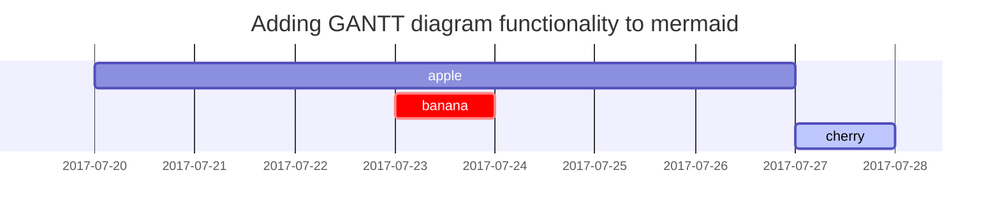

This post is to show Markdown syntax rendering on [**Chirpy**](https://github.com/cotes2020/jekyll-theme-chirpy/fork), you can also use it as an example of writing. Now, let's start looking at text and typography.


## Titles
---
# H1 - heading

<h2 data-toc-skip>H2 - heading</h2>

<h3 data-toc-skip>H3 - heading</h3>

<h4>H4 - heading</h4>
---
<br>

## Paragraph

I wandered lonely as a cloud

That floats on high o'er vales and hills,

When all at once I saw a crowd,

A host, of golden daffodils;

Beside the lake, beneath the trees,

Fluttering and dancing in the breeze.

## Lists

### Ordered list

1. Firstly
2. Secondly
3. Thirdly

### Unordered list

- Chapter
<<<<<<< HEAD
	- Section
      - Paragraph
=======
  - Section
    - Paragraph
>>>>>>> 339321defc3aec22b7e4a86af8fffb659a57e5fe

### Task list

- [ ] TODO
- [x] Completed
- [ ] Defeat COVID-19
  - [x] Vaccine production
  - [ ] Economic recovery
  - [ ] People smile again

### Description list

Sun
: the star around which the earth orbits

Moon
: the natural satellite of the earth, visible by reflected light from the sun

<<<<<<< HEAD

## Block Quote

> This line to shows the Block Quote.
=======
## Block Quote

> This line shows the _block quote_.

## Prompts

> An example showing the `tip` type prompt.
{: .prompt-tip }

> An example showing the `info` type prompt.
{: .prompt-info }

> An example showing the `warning` type prompt.
{: .prompt-warning }

> An example showing the `danger` type prompt.
{: .prompt-danger }
>>>>>>> 339321defc3aec22b7e4a86af8fffb659a57e5fe

## Tables

| Company                      | Contact          | Country |
|:-----------------------------|:-----------------|--------:|
| Alfreds Futterkiste          | Maria Anders     | Germany |
| Island Trading               | Helen Bennett    | UK      |
| Magazzini Alimentari Riuniti | Giovanni Rovelli | Italy   |

## Links

<http://127.0.0.1:4000>

<<<<<<< HEAD

=======
>>>>>>> 339321defc3aec22b7e4a86af8fffb659a57e5fe
## Footnote

Click the hook will locate the footnote[^footnote], and here is another footnote[^fn-nth-2].

<<<<<<< HEAD

=======
>>>>>>> 339321defc3aec22b7e4a86af8fffb659a57e5fe
## Images

- Default (with caption)

<<<<<<< HEAD
{: width="972" height="589" }
=======
{: width="972" height="589" }
>>>>>>> 339321defc3aec22b7e4a86af8fffb659a57e5fe
_Full screen width and center alignment_

<br>

- Shadow

<<<<<<< HEAD
{: .shadow width="1548" height="864" style="max-width: 90%" }
=======
{: .shadow width="1548" height="864" style="max-width: 90%" }
>>>>>>> 339321defc3aec22b7e4a86af8fffb659a57e5fe
_shadow effect (visible in light mode)_

<br>

- Left aligned

<<<<<<< HEAD
{: width="972" height="589" style="max-width: 70%" .normal}
=======
{: width="972" height="589" style="max-width: 70%" .normal}
>>>>>>> 339321defc3aec22b7e4a86af8fffb659a57e5fe

<br>

- Float to left

<<<<<<< HEAD
  {: width="972" height="589" style="max-width: 200px" .left}
=======
  {: width="972" height="589" style="max-width: 200px" .left}
>>>>>>> 339321defc3aec22b7e4a86af8fffb659a57e5fe
  "A repetitive and meaningless text is used to fill the space. A repetitive and meaningless text is used to fill the space. A repetitive and meaningless text is used to fill the space. A repetitive and meaningless text is used to fill the space. A repetitive and meaningless text is used to fill the space. A repetitive and meaningless text is used to fill the space. A repetitive and meaningless text is used to fill the space. A repetitive and meaningless text is used to fill the space. A repetitive and meaningless text is used to fill the space. A repetitive and meaningless text is used to fill the space. A repetitive and meaningless text is used to fill the space. A repetitive and meaningless text is used to fill the space."

<br>

- Float to right

<<<<<<< HEAD
  {: width="972" height="589" style="max-width: 200px" .right}
=======
  {: width="972" height="589" style="max-width: 200px" .right}
>>>>>>> 339321defc3aec22b7e4a86af8fffb659a57e5fe
  "A repetitive and meaningless text is used to fill the space. A repetitive and meaningless text is used to fill the space. A repetitive and meaningless text is used to fill the space. A repetitive and meaningless text is used to fill the space. A repetitive and meaningless text is used to fill the space. A repetitive and meaningless text is used to fill the space. A repetitive and meaningless text is used to fill the space. A repetitive and meaningless text is used to fill the space. A repetitive and meaningless text is used to fill the space. A repetitive and meaningless text is used to fill the space. A repetitive and meaningless text is used to fill the space. A repetitive and meaningless text is used to fill the space."

<br>

## Mermaid SVG



<<<<<<< HEAD

=======
>>>>>>> 339321defc3aec22b7e4a86af8fffb659a57e5fe
## Mathematics

The mathematics powered by [**MathJax**](https://www.mathjax.org/):

$$ \sum_{n=1}^\infty 1/n^2 = \frac{\pi^2}{6} $$

When $a \ne 0$, there are two solutions to $ax^2 + bx + c = 0$ and they are

$$ x = {-b \pm \sqrt{b^2-4ac} \over 2a} $$

<<<<<<< HEAD

=======
>>>>>>> 339321defc3aec22b7e4a86af8fffb659a57e5fe
## Inline code

This is an example of `Inline Code`.

<<<<<<< HEAD
=======
## Filepath

Here is the `/path/to/the/file.extend`{: .filepath}.
>>>>>>> 339321defc3aec22b7e4a86af8fffb659a57e5fe

## Code block

### Common

```
This is a common code snippet, without syntax highlight and line number.
```

### Specific Languages

#### Console

```console
$ env |grep SHELL
SHELL=/usr/local/bin/bash
PYENV_SHELL=bash
```

<<<<<<< HEAD
#### Ruby

```ruby
def sum_eq_n?(arr, n)
  return true if arr.empty? && n == 0
  arr.product(arr).reject { |a,b| a == b }.any? { |a,b| a + b == n }
end
```

#### Shell

```shell
=======
#### Shell

```bash
>>>>>>> 339321defc3aec22b7e4a86af8fffb659a57e5fe
if [ $? -ne 0 ]; then
    echo "The command was not successful.";
    #do the needful / exit
fi;
```

<<<<<<< HEAD
#### Liquid


```liquid

  This product's title contains the word Pack.

```


#### Java

```java
private void writeObject(java.io.ObjectOutputStream s)
  throws java.io.IOException {
  // Write out any hidden serialization magic
  s.defaultWriteObject();
  for (E e: map.keySet()) s.writeObject(e);
}
```
=======
### Specific filename

```sass
@import
  "colors/light-typography",
  "colors/dark-typography"
```
{: file='_sass/jekyll-theme-chirpy.scss'}
>>>>>>> 339321defc3aec22b7e4a86af8fffb659a57e5fe

## Reverse Footnote

[^footnote]: The footnote source
[^fn-nth-2]: The 2nd footnote source
